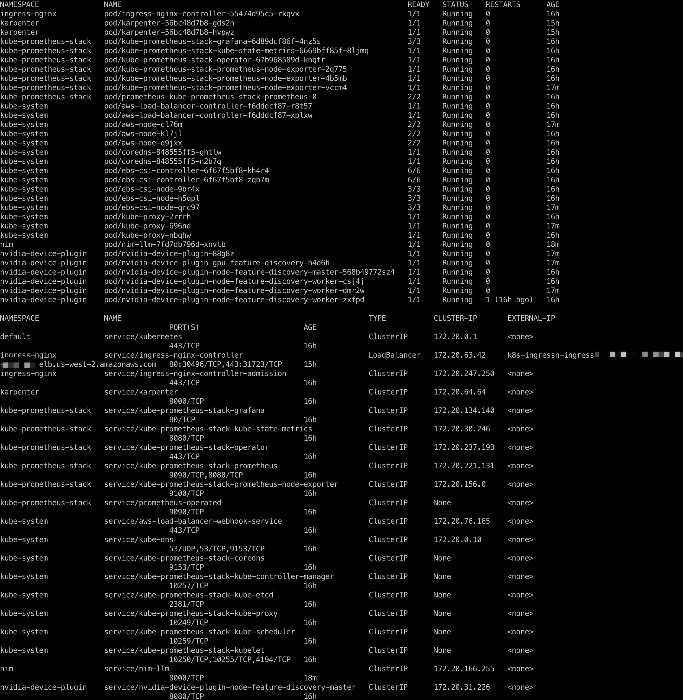

# NVIDIA NIM LLM on EKS

## Setup
1. Configure the NGC API Key. You can retrieve it the [from NVIDIA](https://docs.nvidia.com/ai-enterprise/deployment-guide-spark-rapids-accelerator/0.1.0/appendix-ngc.html).

```
export TF_VAR_ngc_api_key=<replace-with-your-NGC-API-KEY>
```

2. Installation
```
./install.sh
```

It will take around 20 mins to get everything up.

3. Check the status, run

```
kubectl get po,svc -A
```
You should see something similar like this


## Clean up
```
./cleanup.sh
```

<!-- BEGINNING OF PRE-COMMIT-TERRAFORM DOCS HOOK -->
## Requirements

| Name | Version |
|------|---------|
| <a name="requirement_terraform"></a> [terraform](#requirement\_terraform) | >= 1.0.0 |
| <a name="requirement_aws"></a> [aws](#requirement\_aws) | >= 3.72 |
| <a name="requirement_helm"></a> [helm](#requirement\_helm) | >= 2.4.1 |
| <a name="requirement_kubectl"></a> [kubectl](#requirement\_kubectl) | >= 1.14 |
| <a name="requirement_kubernetes"></a> [kubernetes](#requirement\_kubernetes) | >= 2.10 |
| <a name="requirement_null"></a> [null](#requirement\_null) | >= 3.1 |
| <a name="requirement_random"></a> [random](#requirement\_random) | >= 3.1 |

## Providers

| Name | Version |
|------|---------|
| <a name="provider_aws"></a> [aws](#provider\_aws) | >= 3.72 |
| <a name="provider_aws.ecr"></a> [aws.ecr](#provider\_aws.ecr) | >= 3.72 |
| <a name="provider_kubernetes"></a> [kubernetes](#provider\_kubernetes) | >= 2.10 |
| <a name="provider_null"></a> [null](#provider\_null) | >= 3.1 |
| <a name="provider_random"></a> [random](#provider\_random) | >= 3.1 |

## Modules

| Name | Source | Version |
|------|--------|---------|
| <a name="module_data_addons"></a> [data\_addons](#module\_data\_addons) | aws-ia/eks-data-addons/aws | ~> 1.32.0 |
| <a name="module_ebs_csi_driver_irsa"></a> [ebs\_csi\_driver\_irsa](#module\_ebs\_csi\_driver\_irsa) | terraform-aws-modules/iam/aws//modules/iam-role-for-service-accounts-eks | ~> 5.20 |
| <a name="module_eks"></a> [eks](#module\_eks) | terraform-aws-modules/eks/aws | ~> 19.15 |
| <a name="module_eks_blueprints_addons"></a> [eks\_blueprints\_addons](#module\_eks\_blueprints\_addons) | aws-ia/eks-blueprints-addons/aws | ~> 1.2 |
| <a name="module_s3_bucket"></a> [s3\_bucket](#module\_s3\_bucket) | terraform-aws-modules/s3-bucket/aws | 4.1.2 |
| <a name="module_triton_irsa"></a> [triton\_irsa](#module\_triton\_irsa) | aws-ia/eks-blueprints-addon/aws | ~> 1.0 |
| <a name="module_triton_server_vllm_llama2"></a> [triton\_server\_vllm\_llama2](#module\_triton\_server\_vllm\_llama2) | aws-ia/eks-data-addons/aws | ~> 1.32.0 |
| <a name="module_vpc"></a> [vpc](#module\_vpc) | terraform-aws-modules/vpc/aws | ~> 5.0 |

## Resources

| Name | Type |
|------|------|
| [aws_iam_policy.triton](https://registry.terraform.io/providers/hashicorp/aws/latest/docs/resources/iam_policy) | resource |
| [aws_secretsmanager_secret.grafana](https://registry.terraform.io/providers/hashicorp/aws/latest/docs/resources/secretsmanager_secret) | resource |
| [aws_secretsmanager_secret_version.grafana](https://registry.terraform.io/providers/hashicorp/aws/latest/docs/resources/secretsmanager_secret_version) | resource |
| [kubernetes_annotations.disable_gp2](https://registry.terraform.io/providers/hashicorp/kubernetes/latest/docs/resources/annotations) | resource |
| [kubernetes_namespace_v1.triton](https://registry.terraform.io/providers/hashicorp/kubernetes/latest/docs/resources/namespace_v1) | resource |
| [kubernetes_secret_v1.huggingface_token](https://registry.terraform.io/providers/hashicorp/kubernetes/latest/docs/resources/secret_v1) | resource |
| [kubernetes_secret_v1.triton](https://registry.terraform.io/providers/hashicorp/kubernetes/latest/docs/resources/secret_v1) | resource |
| [kubernetes_service_account_v1.triton](https://registry.terraform.io/providers/hashicorp/kubernetes/latest/docs/resources/service_account_v1) | resource |
| [kubernetes_storage_class.default_gp3](https://registry.terraform.io/providers/hashicorp/kubernetes/latest/docs/resources/storage_class) | resource |
| [null_resource.sync_local_to_s3](https://registry.terraform.io/providers/hashicorp/null/latest/docs/resources/resource) | resource |
| [random_password.grafana](https://registry.terraform.io/providers/hashicorp/random/latest/docs/resources/password) | resource |
| [aws_availability_zones.available](https://registry.terraform.io/providers/hashicorp/aws/latest/docs/data-sources/availability_zones) | data source |
| [aws_caller_identity.current](https://registry.terraform.io/providers/hashicorp/aws/latest/docs/data-sources/caller_identity) | data source |
| [aws_ecrpublic_authorization_token.token](https://registry.terraform.io/providers/hashicorp/aws/latest/docs/data-sources/ecrpublic_authorization_token) | data source |
| [aws_eks_cluster_auth.this](https://registry.terraform.io/providers/hashicorp/aws/latest/docs/data-sources/eks_cluster_auth) | data source |
| [aws_iam_policy_document.triton_model](https://registry.terraform.io/providers/hashicorp/aws/latest/docs/data-sources/iam_policy_document) | data source |
| [aws_partition.current](https://registry.terraform.io/providers/hashicorp/aws/latest/docs/data-sources/partition) | data source |
| [aws_region.current](https://registry.terraform.io/providers/hashicorp/aws/latest/docs/data-sources/region) | data source |
| [aws_secretsmanager_secret_version.admin_password_version](https://registry.terraform.io/providers/hashicorp/aws/latest/docs/data-sources/secretsmanager_secret_version) | data source |

## Inputs

| Name | Description | Type | Default | Required |
|------|-------------|------|---------|:--------:|
| <a name="input_eks_cluster_version"></a> [eks\_cluster\_version](#input\_eks\_cluster\_version) | EKS Cluster version | `string` | `"1.29"` | no |
| <a name="input_huggingface_token"></a> [huggingface\_token](#input\_huggingface\_token) | Hugging Face Secret Token | `string` | `"DUMMY_TOKEN_REPLACE_ME"` | no |
| <a name="input_name"></a> [name](#input\_name) | Name of the VPC and EKS Cluster | `string` | `"nvidia-triton-server"` | no |
| <a name="input_region"></a> [region](#input\_region) | region | `string` | `"us-west-2"` | no |
| <a name="input_secondary_cidr_blocks"></a> [secondary\_cidr\_blocks](#input\_secondary\_cidr\_blocks) | Secondary CIDR blocks to be attached to VPC | `list(string)` | <pre>[<br>  "100.64.0.0/16"<br>]</pre> | no |
| <a name="input_vpc_cidr"></a> [vpc\_cidr](#input\_vpc\_cidr) | VPC CIDR. This should be a valid private (RFC 1918) CIDR range | `string` | `"10.1.0.0/21"` | no |

## Outputs

| Name | Description |
|------|-------------|
| <a name="output_configure_kubectl"></a> [configure\_kubectl](#output\_configure\_kubectl) | Configure kubectl: make sure you're logged in with the correct AWS profile and run the following command to update your kubeconfig |
| <a name="output_grafana_secret_name"></a> [grafana\_secret\_name](#output\_grafana\_secret\_name) | The name of the secret containing the Grafana admin password. |
| <a name="output_s3_bucket_name"></a> [s3\_bucket\_name](#output\_s3\_bucket\_name) | The name of the S3 bucket. |
| <a name="output_s3_bucket_region"></a> [s3\_bucket\_region](#output\_s3\_bucket\_region) | The AWS region this bucket resides in. |
<!-- END OF PRE-COMMIT-TERRAFORM DOCS HOOK -->
